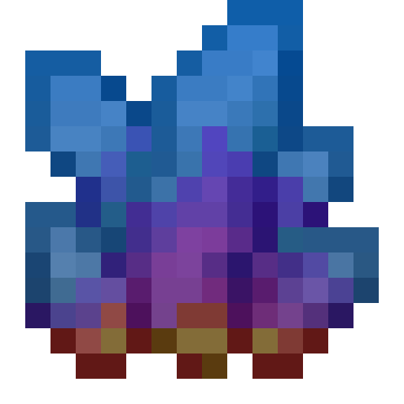

# Oceanica

[>> Downloads <<](https://github.com/Boundarybreaker/Oceanica/releases)

*What would you like to make?*

**This mod is open source and under a permissive license.** As such, it can be included in any modpack on any platform without prior permission. We appreciate hearing about people using our mods, but you do not need to ask to use them. See the [LICENSE file](LICENSE) for more details.

Oceanica is a Fabric mod for 1.16 that is being created for B0undarybreaker's Minecraft modding tutorial series. It adds a new material, called Oceanic Quartz, which can be used to make tools and armor that improve as they're used.

New builds will be published with the progress of each episode. You can find them in the [releases](https://github.com/Boundarybreaker/Oceanica/releases) section.
